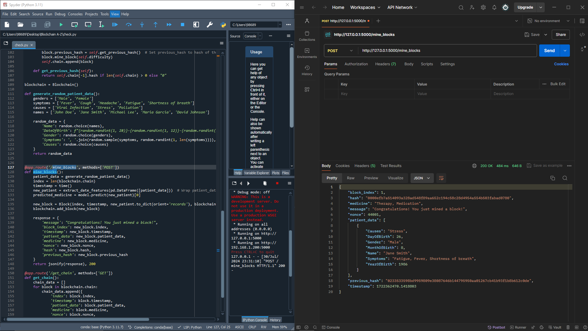
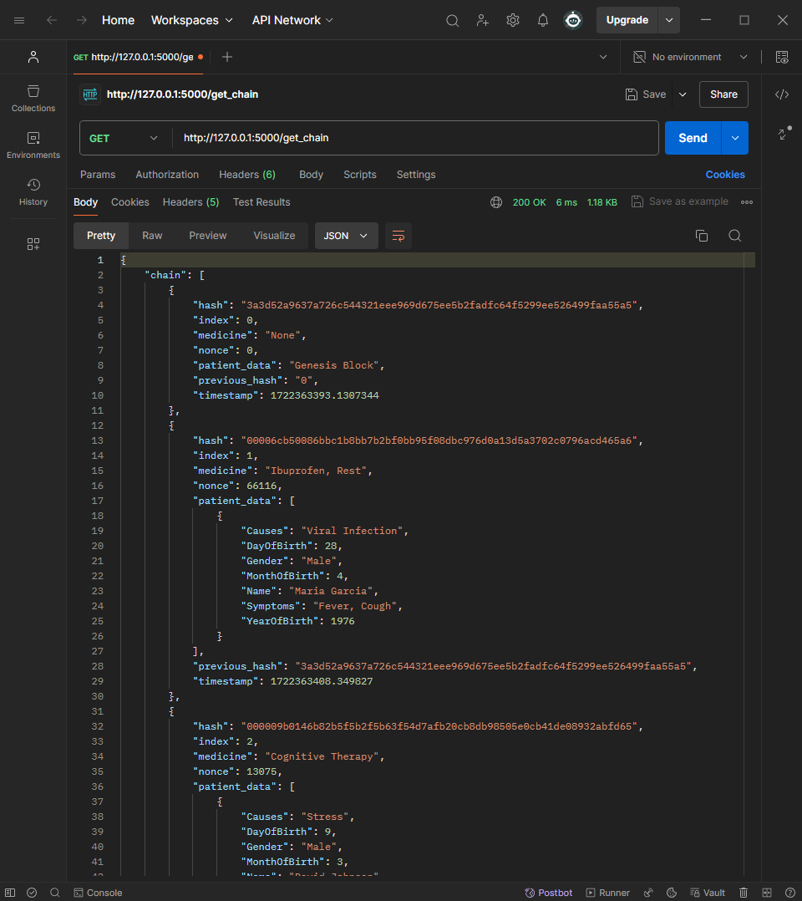

# HealthCare-Medicine-Recommendation-Using-Blockchain

This project aims to leverage blockchain technology to revolutionize the healthcare industry by providing a secure, transparent, and efficient medicine recommendation system. By integrating blockchain, we ensure that patient data is immutable and securely shared among healthcare providers, enhancing trust and collaboration. The system utilizes advanced algorithms to analyze patient health records, medical history, and other relevant data to recommend personalized medication plans. This innovative approach not only enhances the accuracy of medical recommendations but also ensures patient privacy and data integrity, ultimately leading to improved healthcare outcomes.

<h1>Mine Block in Blockchain</h1>

Mining a block is a crucial process in blockchain technology, where transactions are validated and added to the blockchain ledger. This process involves several key steps:

<ul>
  <li><strong>Transaction Collection:</strong> New transactions are collected into a block.</li>
  <li><strong>Hash Calculation:</strong> Miners compute a hash for the block. This involves solving a complex mathematical problem.</li>
  <li><strong>Proof of Work:</strong> The miner must find a hash that meets the difficulty criteria set by the network. This requires significant computational power and time.</li>
  <li><strong>Block Validation:</strong> Once a valid hash is found, the block is broadcast to the network for validation.</li>
  <li><strong>Block Addition:</strong> Validated blocks are added to the blockchain, and the miner is rewarded for their efforts.</li>
</ul>

<h2>Key Features</h2>

<ul>
  <li><strong>Decentralization:</strong> No central authority controls the process; it's a collective effort.</li>
  <li><strong>Security:</strong> The difficulty of solving the hash ensures the network's security and prevents tampering.</li>
  <li><strong>Transparency:</strong> All transactions within the block are visible to all participants.</li>
</ul>

  

<h1>Full Chain Output of Blockchain</h1>

The <strong>full chain output</strong> of a blockchain represents the complete and sequential list of blocks that have been validated and added to the blockchain network. This output encapsulates the entire history of transactions and data exchanges within the blockchain, ensuring transparency, security, and integrity.

<h2>Key Components</h2>

<ul>
  <li><strong>Genesis Block:</strong> The very first block in the blockchain, serving as the foundation for all subsequent blocks.</li>
  <li><strong>Block Sequence:</strong> Each block contains a reference to the previous block, forming an unbroken chain.</li>
  <li><strong>Transactions:</strong> Each block includes a list of transactions that have been verified and confirmed.</li>
  <li><strong>Hash Values:</strong> Unique cryptographic hashes that ensure the integrity and immutability of each block.</li>
  <li><strong>Merkle Tree:</strong> A data structure that efficiently summarizes and verifies the integrity of all transactions within a block.</li>
  <li><strong>Timestamp:</strong> Each block is timestamped, providing a chronological order of events.</li>
</ul>

<h2>Key Features</h2>

<ul>
  <li><strong>Immutability:</strong> Once added to the blockchain, blocks cannot be altered, ensuring the integrity of the data.</li>
  <li><strong>Transparency:</strong> All participants in the network can view the entire chain, promoting openness and trust.</li>
  <li><strong>Security:</strong> Cryptographic hashes and the decentralized nature of the blockchain provide robust security against tampering and fraud.</li>
</ul>

<h2>Stylish Representation</h2>

Here's a stylish representation of the full chain output in a blockchain:

